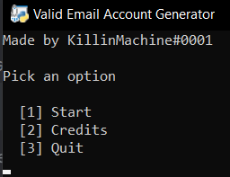
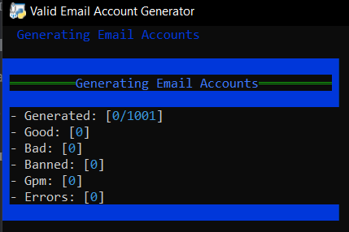

# Email Account Generator Checker
This Python program works by generating a random email and password and checks it. You have the option of how many emails you want to generate and check and it will generate the amount you want (it goes off how much were created not how much are valid). The chances of actually getting a working account are low I believe it mostly depends on the proxies you use and if you have multiple of these running.

## Issues
You most likely will get many errors based off the proxies you are using. Report anything else in my discord: https://discord.gg/JcAvQc797r

## Installing
```
git clone https://github.com/MachineKillin/Email-Account-Generator-Checker
cd Email-Account-Generator-Checker
pip install -r requirements.txt
python3 main.py
```
## Pictures

 

